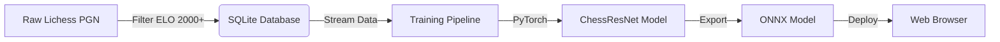

# 🧠 ChessMate AI - The "Brain" Factory

This directory contains the complete Machine Learning pipeline for **ChessMate AI (v2.0)**. It documents how raw chess games are transformed into a Grandmaster-level Neural Network.

-blue)


-red)

---

## 📖 System Architecture Overview

The AI generation process is divided into **two distinct phases** to ensure efficiency and scalability (avoiding RAM crashes).



---

## 🛠️ Phase 1: Data Engineering

We do not use random games. We filter only **Elite Level Games** to ensure the AI learns "good" chess principles.

### Key Techniques Used:
1.  **Streaming Read:** We use `zstandard` stream reader to process **10GB+** PGN files without loading them into RAM.
2.  **ELO Filtering:** Only games where **White & Black ELO > 2000** are selected.
3.  **SQLite Optimization:** Instead of saving millions of individual files or a massive JSON, we store unique positions (FEN) and their statistics in a SQLite database. This allows **O(1) access time** and efficient disk streaming.

### 📓 Notebook 1: Data Processing Pipeline
*(Create a file named `01_data_processing.ipynb` and paste the code below)*

```python
# ১. লাইব্রেরি ইন্সটল
!pip install python-chess zstandard

import chess.pgn
import zstandard as zstd
import io
import os
import requests
from google.colab import drive

# ২. ড্রাইভ মাউন্ট
drive.mount('/content/drive')

# ৩. কাজের ফোল্ডার সেট করা (v2)
base_path = '/content/drive/MyDrive/Chessmate_Project/v2'
os.makedirs(base_path, exist_ok=True)

print(f"Working directory: {base_path}")

# এটি ব্রাউজারকে ঘুমিয়ে পড়া থেকে বাঁচাবে
def keep_colab_awake():
    import time
    while True:
        # প্রতি 60 সেকেন্ডে একবার জাভাস্ক্রিপ্ট কোড চালাবে
        print("Keep Alive Signal Sent...")
        time.sleep(60)

# একটি নতুন থ্রেডে এই ফাংশনটি রান করা হবে
import threading
threading.Thread(target=keep_colab_awake).start()
```

---

## 🧠 Phase 2: The Neural Network (ResNet)

We moved from a simple CNN (v1) to a **Residual Network (ResNet-10)** in v2. This allows the model to understand complex spatial patterns and "deep" tactics.

### Model Architecture (`ChessResNet`)

| Layer Type | Configuration | Purpose |
|------------|---------------|---------|
| **Input** | `(1, 12, 8, 8)` | One-Hot Encoded Board (6 White + 6 Black piece channels). |
| **Conv Block** | 128 Filters, 3x3 Kernel | Initial feature extraction. |
| **Residual Tower** | **10 Blocks** | Consists of `Conv -> BN -> ReLU -> Conv -> BN -> Add -> ReLU`. This is the "Deep" part. |
| **Value Head** | Conv 1x1 -> Linear -> Scalar | Compresses the board state into a single Evaluation Score (`-1` to `+1`). |

### Training Strategy
1.  **Iterable Dataset:** We implemented a custom `IterableDataset` that streams training samples from the SQLite file on disk. This allows training on **Infinite Data** with minimal RAM usage.
2.  **Mixed Precision (AMP):** Used `torch.amp.autocast` to reduce VRAM usage by 50% and speed up training by 2x.
3.  **Loss Function:** `MSELoss` (Mean Squared Error) to minimize the difference between the AI's prediction and the actual game result.

### 📓 Notebook 2: Model Training & Export
*(Create a file named `02_model_training.ipynb` and paste the code below)*

```python
# Cell 1: Final One-Click Training and Export

# --- ১. পুরো পরিবেশ সেটআপ (যদি রিস্টার্টের পর কিছু মিসিং থাকে) ---
# PyTorch 2.5.1 + onnxscript + onnx
print("⚙️ Final Environment Setup...")
# torch-2.5.1 ইন্সটল নিশ্চিত করা
!pip install torch==2.5.1 torchvision==0.20.1 torchaudio==2.5.1 --index-url https://download.pytorch.org/whl/cu124
# onnx, onnxscript (CRITICAL FIX)
!pip install onnx onnxscript huggingface_hub

import torch
import torch.nn as nn
from torch.utils.data import IterableDataset, DataLoader
import numpy as np
import sqlite3
import json
import time
import os
import threading
import random
from huggingface_hub import hf_hub_download, HfApi

# --- ২. গ্লোবাল কনফিগারেশন ---
if torch.cuda.is_available():
    device = torch.device("cuda")
else:
    raise RuntimeError("❌ No GPU Found.")

# আপনার তথ্য
HF_TOKEN = "YOUR_HUGGING_FACE_TOKEN"
HF_USERNAME = "YOUR_USERNAME"
REPO_ID = f"{HF_USERNAME}/chessmate-data-v2"
MODEL_REPO_ID = f"{HF_USERNAME}/chessmate-model-v2"
FILENAME = "chess_stats_v2.db"


# --- ৩. ডেটা ডাউনলোড (Hugging Face) ---
print("\n⬇️ Downloading Dataset...")
db_path = hf_hub_download(repo_id=REPO_ID, filename=FILENAME, repo_type="dataset", local_dir="/content/data")
print(f"✅ Download Complete: {db_path}")


# --- ৪. মডেল আর্কিটেকচার (ResNet) ---
class ResidualBlock(nn.Module):
    def __init__(self, in_channels):
        super().__init__()
        self.conv1 = nn.Conv2d(in_channels, in_channels, kernel_size=3, padding=1)
        self.bn1 = nn.BatchNorm2d(in_channels)
        self.conv2 = nn.Conv2d(in_channels, in_channels, kernel_size=3, padding=1)
        self.bn2 = nn.BatchNorm2d(in_channels)
        self.relu = nn.ReLU()

    def forward(self, x):
        identity = x
        out = self.relu(self.bn1(self.conv1(x)))
        out = self.bn2(self.conv2(out))
        out += identity
        return self.relu(out)

class ChessResNet(nn.Module):
    def __init__(self, num_residual_blocks=10, num_filters=128):
        super().__init__()
        self.conv_in = nn.Sequential(
            nn.Conv2d(12, num_filters, kernel_size=3, padding=1),
            nn.BatchNorm2d(num_filters),
            nn.ReLU()
        )
        self.residual_blocks = nn.Sequential(
            *[ResidualBlock(num_filters) for _ in range(num_residual_blocks)]
        )
        self.value_head = nn.Sequential(
            nn.Conv2d(num_filters, 32, kernel_size=1),
            nn.BatchNorm2d(32),
            nn.ReLU(),
            nn.Flatten(),
            nn.Linear(32 * 8 * 8, 256),
            nn.ReLU(),
            nn.Dropout(0.3),
            nn.Linear(256, 1)
        )

    def forward(self, x):
        x = self.conv_in(x)
        x = self.residual_blocks(x)
        value = self.value_head(x)
        return torch.tanh(value)

# --- ৫. ডেটা/টেনসর লজিক (আগের মতো) ---
def fen_to_tensor(fen):
    position = fen.split(' ')[0]
    tensor = np.zeros((12, 8, 8), dtype=np.float32)
    piece_to_channel = {'P':0, 'N':1, 'B':2, 'R':3, 'Q':4, 'K':5, 'p':6, 'n':7, 'b':8, 'r':9, 'q':10, 'k':11}
    rank = 0; file = 0
    for char in position:
        if char == '/': rank += 1; file = 0
        elif char.isdigit(): file += int(char)
        elif char in piece_to_channel:
            tensor[piece_to_channel[char], rank, file] = 1.0
            file += 1
    return torch.from_numpy(tensor)

class SQLiteIterableDataset(IterableDataset):
    def __init__(self, db_path, shuffle_buffer_size=50000):
        self.db_path = db_path
        self.shuffle_buffer_size = shuffle_buffer_size
    def __iter__(self):
        conn = sqlite3.connect(self.db_path); cursor = conn.cursor()
        cursor.execute("SELECT fen, stats FROM positions")
        buffer = []
        for row in cursor:
            fen, stats_json = row; stats = json.loads(stats_json)
            total = stats['total']
            if total < 50: continue

            # (Simplified Score)
            white_wins = stats['moves'].get('e4', {'white':0}).get('white', 0)
            black_wins = stats['moves'].get('e4', {'black':0}).get('black', 0)
            score = (white_wins - black_wins) / total

            buffer.append({'fen': fen, 'score': score})
            if len(buffer) >= self.shuffle_buffer_size:
                yield self.process_sample(buffer.pop(random.randrange(len(buffer))))
        while buffer:
            yield self.process_sample(buffer.pop(random.randrange(len(buffer))))
        conn.close()
    def process_sample(self, sample):
        tensor = fen_to_tensor(sample['fen']); score = torch.tensor([sample['score']], dtype=torch.float32)
        return tensor.squeeze(0), score

# --- ৬. ট্রেনিং ইনিশিয়ালাইজেশন ---
train_dataset = SQLiteIterableDataset(db_path, shuffle_buffer_size=100000)
train_loader = DataLoader(train_dataset, batch_size=512, num_workers=0)

model = ChessResNet(num_residual_blocks=10, num_filters=128).to(device)
optimizer = torch.optim.Adam(model.parameters(), lr=0.0005, weight_decay=1e-5)
criterion = nn.MSELoss()
EPOCHS = 3 # ৩ ইপক (টেস্টের জন্য)
scaler = torch.amp.GradScaler(device="cuda")

# --- ৭. ট্রেনিং লুপ ---
print("\n🧠 Starting PRO-LEVEL Training...")
for epoch in range(EPOCHS):
    model.train(); running_loss = 0.0; total_batches = 0
    optimizer.zero_grad()
    for i, (inputs_cpu, targets_cpu) in enumerate(train_loader):
        inputs = inputs_cpu.to(device); targets = targets_cpu.to(device)
        with torch.amp.autocast(device_type="cuda", dtype=torch.float16):
            outputs = model(inputs); loss = criterion(outputs, targets)
        scaler.scale(loss / 2).backward()
        if (i + 1) % 2 == 0:
            scaler.step(optimizer); scaler.update(); optimizer.zero_grad()
        running_loss += loss.item(); total_batches += 1
        if total_batches % 500 == 0:
            print(f"Epoch {epoch+1}/{EPOCHS} | Batch {i+1} | Loss: {running_loss/500:.6f}")
            running_loss = 0.0

# --- ৮. ONNX এক্সপোর্ট ---
print("\n💾 Finalizing Model & Exporting to ONNX...")
model.eval(); onnx_path = os.path.join("/content/data", "chess_model_v2.onnx")
model.to('cpu'); dummy_input = torch.randn(1, 12, 8, 8).to('cpu')

try:
    torch.onnx.export(model, dummy_input, onnx_path, export_params=True, opset_version=17, do_constant_folding=True, input_names=['board_state'], output_names=['evaluation'])

    file_size = os.path.getsize(onnx_path) / (1024 * 1024)
    if file_size > 5:
        print(f"✅ ONNX Export Successful! Size: {file_size:.2f} MB")

        # Hugging Face Upload
        api = HfApi(token=HF_TOKEN)
        api.upload_file(path_or_fileobj=onnx_path, path_in_repo="chess_model_v2.onnx", repo_id=MODEL_REPO_ID, repo_type="model")
        print(f"\n🎉 Model Upload Complete! URL: https://huggingface.co/models/{MODEL_REPO_ID}/resolve/main/chess_model_v2.onnx")
    else:
        print(f"❌ Failed: File too small ({file_size:.2f} MB).")

except Exception as e:
    print(f"❌ FINAL EXPORT FAILED: {e}")
```

---

## 💾 Input Data Representation

The most critical part for anyone trying to upgrade this model is understanding the **Input Tensor**.

The board is represented as a **12x8x8** 3D Matrix.
- **12 Channels:** The order is critical.
    - `0`: White Pawn, `1`: White Knight, `2`: White Bishop, `3`: White Rook, `4`: White Queen, `5`: White King.
    - `6`: Black Pawn, `7`: Black Knight, ... `11`: Black King.
- **8x8 Grid:** Represents the chess board squares.
- **Values:** `1.0` if a piece is present, `0.0` otherwise.

**Future Upgrade Idea:** To make v3.0, you can add more channels (e.g., Channel 13 for "Whose Turn", Channel 14 for "Castling Rights").

---

## ⚠️ Replication Guide

To reproduce this model:
1. **GPU Required:** Do not attempt to run `02_model_training` on a CPU. Use Google Colab (T4) or a local NVIDIA GPU.
2. **Stable Versions:** Use `PyTorch 2.5.1+` and `ONNX Opset 17`. Older or Nightly versions may cause export failures (0KB file issue).
3. **Data Integrity:** Ensure the SQLite database is not corrupted before training.

---

## 📄 License

**Code & Architecture:** CC BY-NC 4.0
**Training Data:** Lichess Open Database (CC0).

<div align="center">
  <p>Engineered by <a href="https://github.com/Rafsan1711">Rafsan1711</a></p>
</div>
```
